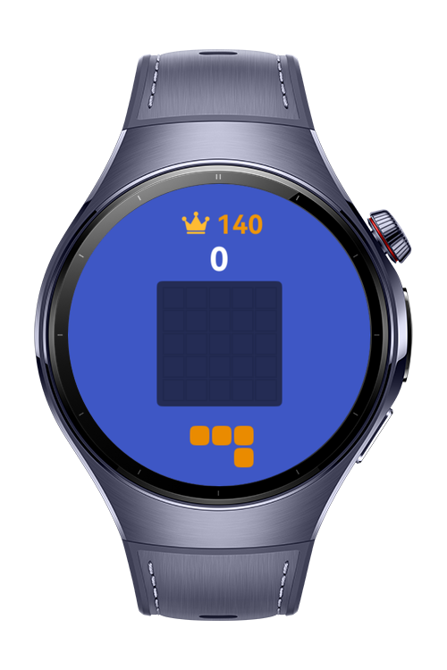
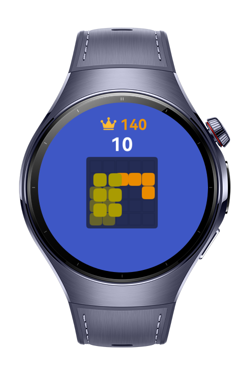
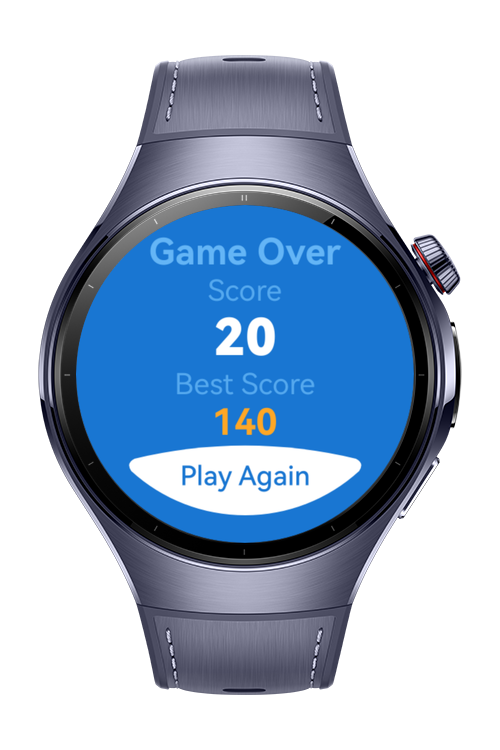

> **Note:** To access all shared projects, get information about environment setup, and view other guides, please visit [Explore-In-HMOS-Wearable Index](https://github.com/Explore-In-HMOS-Wearable/hmos-index).

# Block Game

Block Game is a captivating puzzle game that challenges you to fit different block shapes onto a grid, clearing lines to score points.

# Preview

<div>    
  
  
  
  
</div> 

# Use Cases

Quick entertainment during free time with its simple yet addictive gameplay mechanics that keep players engaged.

# Tech Stack

- **Languages**: ArkTS
- **Frameworks**: HarmonyOS SDK 5.1.0(18)
- **Tools**: DevEco Studio Vers 5.1.0.842
- **Libraries**: @kit.ArkUI, @ohos/lottie

# Directory Structure

````
├───AppScope
│   └───resources
│       └───base
│           ├───element
│           └───media
├───entry
│   └───src
│       ├───main
│       │   ├───ets
│       │   │   ├───components
│       │   │   ├───├───GameBoard
│       │   │   │   └───SourceArea 
│       │   │   ├───model
│       │   │   │    └───Game
│       │   │   ├───pages 
│       │   │   │   ├───Game
│       │   │   │   ├───GameOver
│       │   │   │   └───Splash
│       │   │   ├───utils
│       │   │   │   └───Logger
│       │   └───resources
│       │       ├───base
│       │       │   ├───element
│       │       │   ├───media
│       │       │   └───profile
````

# Constraints and Restrictions

## Suported Devices

- Huawei Watch 5

# LICENSE

Block Game is distributed under the terms of the MIT License.
See the [LICENSE](/LICENSE) for more information.

